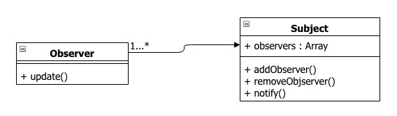

# Vanilla-TS-Scss boilerplate

- Webpack5, TS, Scss, Jest
- `npm i`
- `npm run build`
- `npm test`
- Structure

## Spec
- 이미지 슬라이더
- 상단 작은 썸네일은 N개 단위로 이동(Not Infinite)
- 메인 큰 썸네일은 1개 단위로 이동(Infinite)

## Observer
- React의 컴포넌트 개념
- View-Model 이라고 볼수있다.
- 화면을 렌더링하고, 이벤트를 바인딩한다.
- 상태값을 참조하고 .
- 스토어에 옵저버객체를 등록해둔다.

## Subject
- Redux의 Provider 개념
- 상태값이 변경될때 옵저버들에게 notify 해준다.

## State
- Redux의 Store 개념
- 실제 상태값을 가지고 있고, 상태값을 업데이트한다.
- 옵저버들에게 notify 할 때 새로운 상태값을 함께 전달한다.

## 모델
- 상태값을 추상화한 개념(말 그대로 추상 모델링)

## Reference
https://webdevstudios.com/2019/02/19/observable-pattern-in-javascript/
